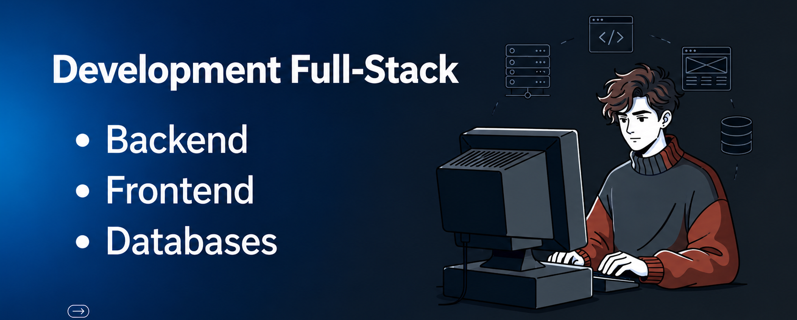

#  Welcome to my Profile! 

I am a Systems Engineering student at ITM in Medellín, Colombia.

Throughout my academic training, I have developed various technical projects. Currently, my primary backend language is Java, combined with MariaDB. Thanks to this, along with my frontend skills, I am currently building high-impact projects for the near future. My main strengths are dedication and a passion for software development. If you are interested in my profile, feel free to contact contact me!

## Tecnologias 💻

